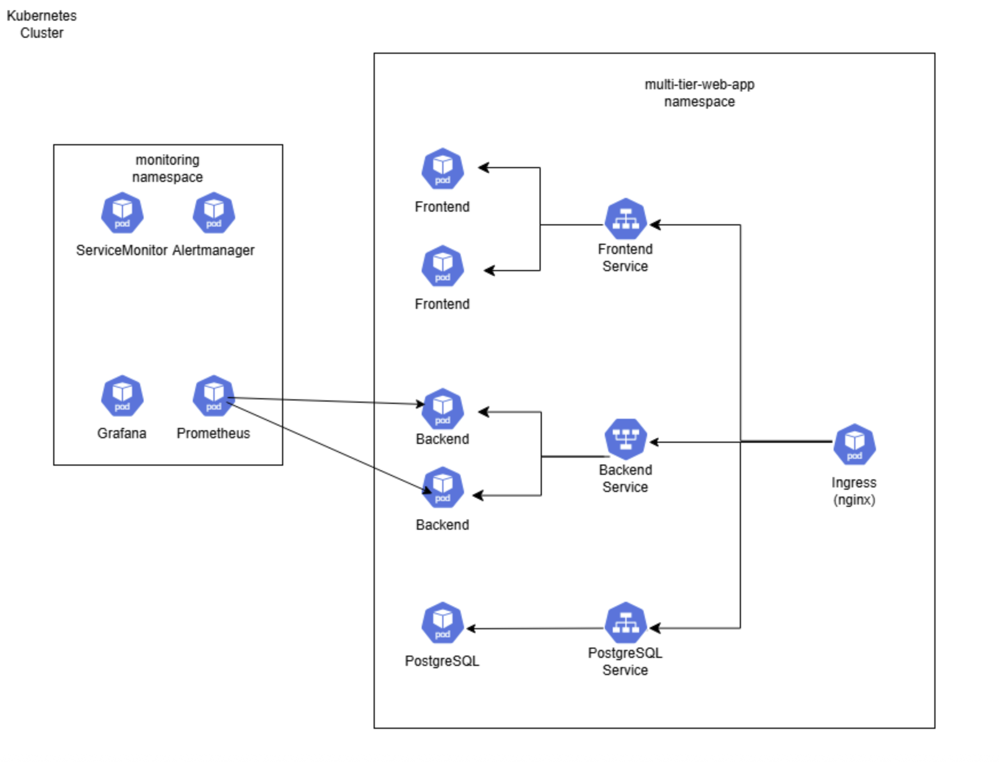

# Kubernetes-with-Monitoring
This project demonstrates a production-style Kubernetes deployment of a web application with full observability using Alertmanager, Prometheus and Grafana

---

## Architecture Overview

The system is deployed into two Kubernetes namespaces:

- multi-tier-web-app  
  - Frontend (static web app)  
  - Backend (Node.js API with Prometheus metrics)  
  - PostgreSQL (StatefulSet)  
  - Ingress (NGINX)  

- monitoring  
  - Prometheus (metrics collection and alert evaluation)  
  - Grafana (visualization)  
  - Alertmanager (alert routing and grouping)  

Prometheus scrapes metrics from the backend service via a ServiceMonitor. Alert rules are evaluated in Prometheus and forwarded to Alertmanager.

---

## Folder Structure

```
.
├── backend
│   ├── Dockerfile
│   ├── index.js
│   ├── package.json
│   ├── package-lock.json
│   └── node_modules
│
├── docs
│   ├── k8s-architecture.png
│
│
├── frontend
│   ├── Dockerfile
│   └── index.html
│
├── k8s
│   ├── alertmanager-config.yaml
│   ├── backend-alerts.yaml
│   ├── backend-deployment.yaml
│   ├── backend-hpa.yaml
│   ├── backend-service.yaml
│   ├── backend-service-monitor.yaml
│   ├── frontend-deployment.yaml
│   ├── frontend-service.yaml
│   ├── ingress.yaml
│   ├── namespace.yaml
│   ├── postgres-deployment.yaml
│   ├── postgres-headless-service.yaml
│   ├── postgres-secret.yaml
│   ├── postgres-service.yaml
│   └── postgres-statefulset.yaml
```

---

## Backend

- Node.js + Express API
- Exposes `/metrics` endpoint using prom-client
- Collects default Node.js metrics and HTTP request latency
- Containerized with Docker
- Horizontally scalable using HPA

---

## Frontend

- Static HTML frontend
- Containerized with Docker
- Exposed internally via ClusterIP service
- Accessed externally through NGINX Ingress

---

## Database

- PostgreSQL deployed as a StatefulSet
- Persistent storage
- Credentials managed via Kubernetes Secrets
- Headless service for stable network identity

---

## Monitoring and Alerting

- Prometheus  
  - Scrapes backend metrics using a ServiceMonitor  
  - Evaluates alert rules defined in backend-alerts.yaml  

- Grafana  
  - Uses Prometheus as a data source  
  - Dashboards visualize backend availability and performance  

- Alertmanager  
  - Receives alerts from Prometheus  
  - Groups and displays alerts (for example, BackendDown)  

Example alert:
- BackendDown fires when all backend pods are unavailable in the web-app namespace.

---

## Deployment Steps

1. Build and push Docker images for frontend and backend
2. Create namespaces:
   kubectl apply -f k8s/namespace.yaml
3. Deploy database resources
4. Deploy backend and frontend services
5. Apply monitoring and alerting manifests
6. Access the application via Ingress
7. Access Grafana and Prometheus via port-forwarding

---

## Key Kubernetes Concepts Demonstrated

- Namespaces for workload isolation
- Deployments, StatefulSets, and Services
- Ingress and service routing
- Horizontal Pod Autoscaling
- Prometheus metrics and ServiceMonitors
- Alerting with PrometheusRule and Alertmanager
- Production-style observability architecture

---

## Purpose

This project demonstrates real-world Kubernetes application deployment and observability practices

---

An architecture diagram is included to show how all components interact.



---

